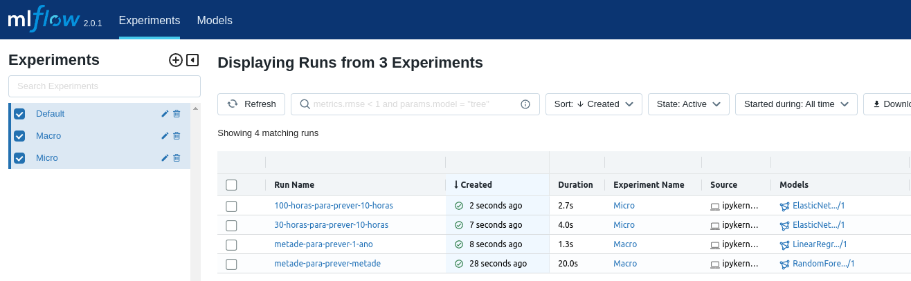

# fiec-cientista-de-dados

Este desafio usa um conjunto de dados de séries temporais de clima registrado pelo Instituto Max
Planck de Biogeoquímica. Este conjunto de dados contém 14 *features* diferentes, como temperatura do ar, pressão atmosférica e umidade. Estes dados foram coletados a cada 10 minutos, a partir de 2003. Os [dados utilizados](https://storage.googleapis.com/tensorflow/tf-keras-datasets/jena_climate_2009_2016.csv.zip) são referentes ao período de 2009 até 2016.


##  :zap: **Tecnologias**

- *Matptlotlib*
- *Scikit-Learn*
- *MLFlow*
- *Docker*
- Dentre outras...

## :hammer: Como executar o projeto

Para executar o projeto, disponibilizamos um  `docker-compose.yaml` contendo as configurações necessárias para executar o projeto como um todo.

**1. Definir as variáveis de ambiente**

O arquivo  `.env.example`  contém todas as variáveis de ambientes utilizadas que podem ser modificadas.

```shell
# renomear o arquivo de exemplo
mv .env.example .env
```

**2. Executar o *docker compose***

```shell
# executar todo os container em segundo plano (-d)
docker compose up -d
```

**3. Acessando a aplicação**

- http://localhost:8889/lab - *JupyterLab* contendo análise e experimento

  - **src/** - contém todos os *notebooks*
  - **data/** - conjunto de dados utilizado

  

- http://localhost:9001/ - Acesso ao *MinIO* (*object store* usado pelo *MLFlow*)

  - Informar credenciais do arquivo .env 

    - > Se não foi modificado, então `minio` e `minio123` respectivamente

  

- http://localhost:5000/ - Acesso ao MLFlow, onde os experimentos serão registrados 

  - > Obs: Após executar o terceiro *notebook* , é necessário atualizar a página para verificar os experimentos salvos no painel

  
  
  
